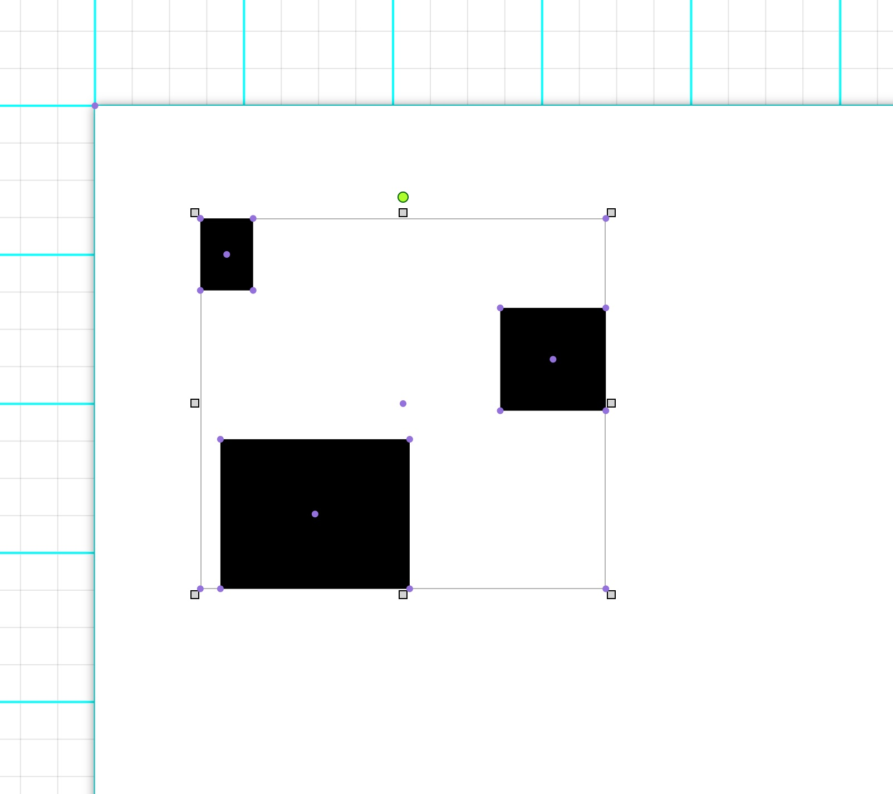
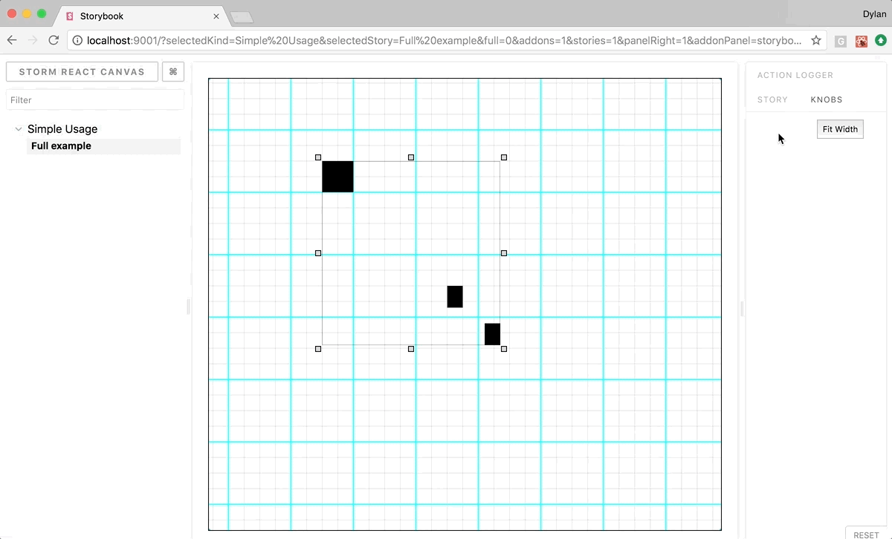
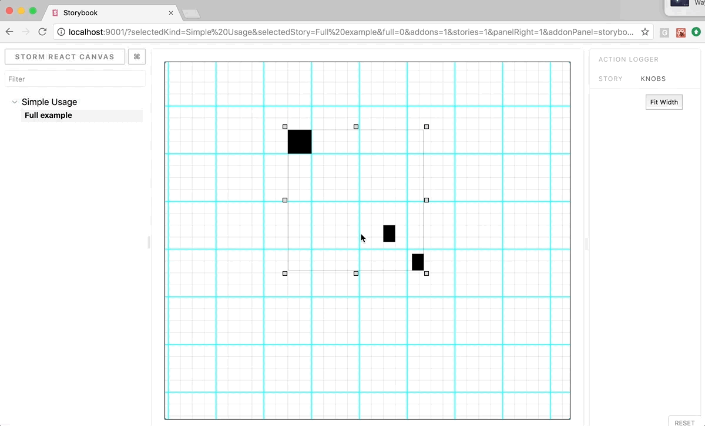
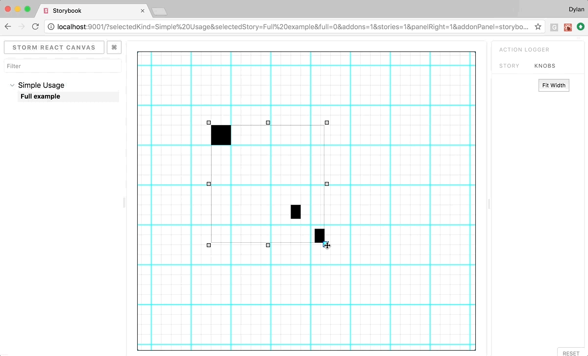
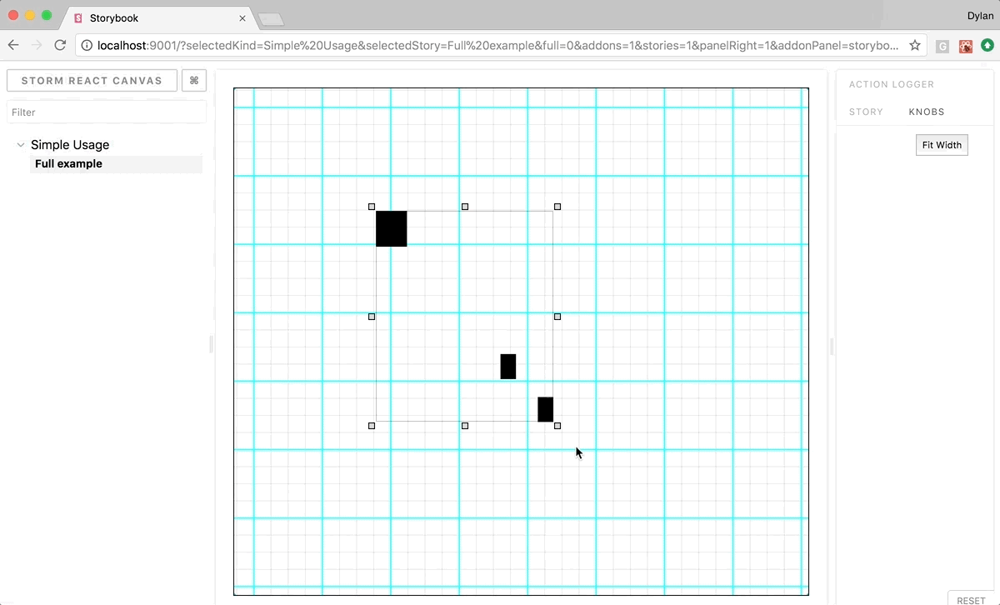
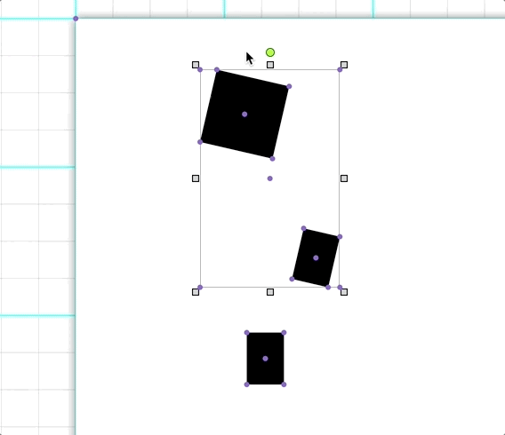
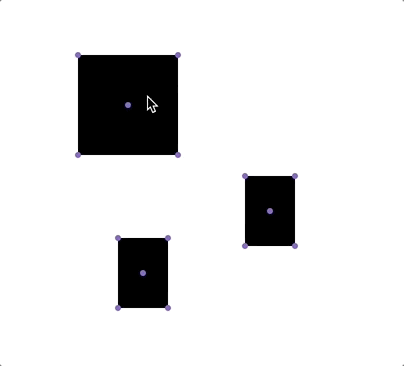

Note: this project was an experiment for me (Dylan Vorster) where I learnt all about desktop publishing systems (DTP). A lot of the concepts I implemented here, I moved over to react-diagrams such as layers etc.. I still plan to revisit a lot of these ideas there, and maybe port over some of the elements such as the infinite grid and page layout. Thanks for your interest in this project though, it meant a lot to me <3 , I never thought a throwaway project like this would end up with so many Github stars x_x

# STORM React canvas (Archived)

A brand new foundation for storm-react-diagrams

## Features

#### Core
* virtual co-ordinate system
* real co-ordinate system
* matrix transformation, precomputed and optimized
* forward dimensions and inferred dimensions
* history push and pop (wip)
* SVG and standard DOM support
* pluggable event bus
* pluggable state machine
* model driven with serialization layers (imperative and declarative styles)
* serialization and deserialization

#### Canvas
* translate / panning
* zoom
* de-select elements
* fit to width
* multiple ordered layers
* ordered elements on layers

#### Primitives
* multiple infinite grids
* point based vectors (wip)
* ellipse
* rectangles
* pages

### Groups
* group selection
* group translate
* group scaling from any anchor point
* group rotation from origin (or any arbitrary point)
* group transform with mirror modifiers (wip)

| 	|	|
|---|---|
|  |  |
|  |  |
|  |  |
